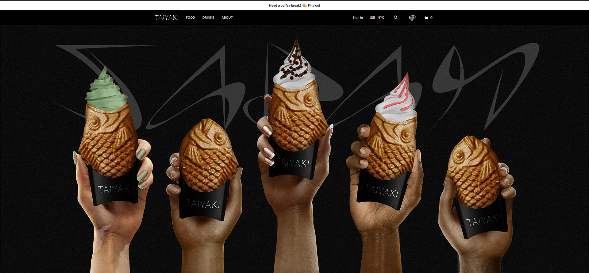
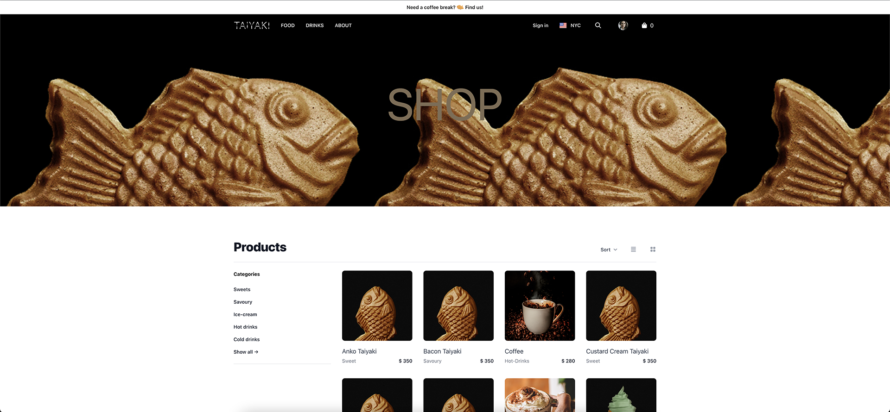
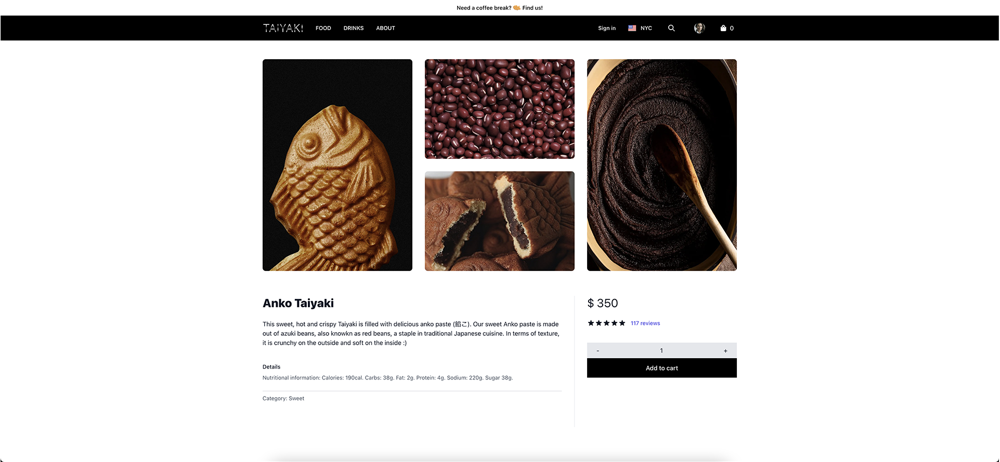
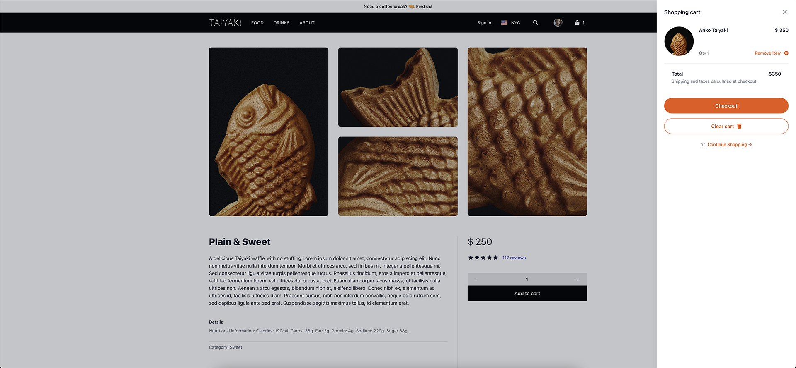
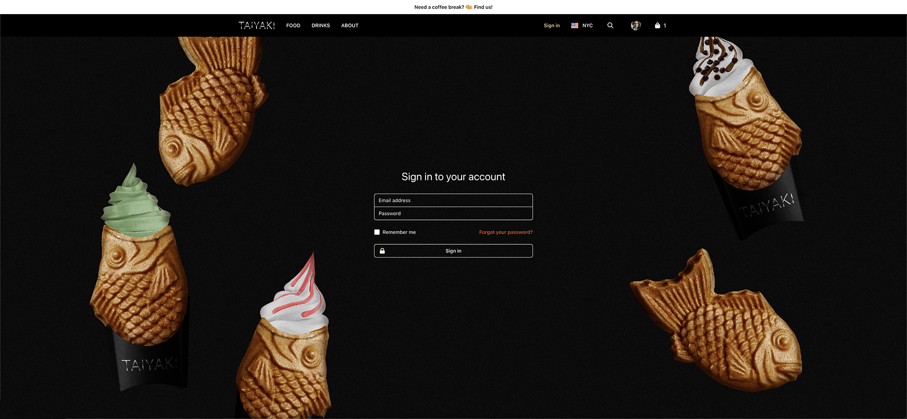

# Taiyaki | Ivana Braz | ReactJs CODERHOUSE

  

  ## Overview
  This project was created for the ReactJs Course (24915) at [CODERHOUSE](https://www.coderhouse.com/).
  
   
   

  ## About | Sobre
  🇬🇧 EN 
  Hello👋 My name is [Ivana Braz](http://github.com/ivanabraz). 
   
  For this final work I've decided to materialize a personal project called **Taiyaki**. This concept store offers an unique gastronomic proposal, based on the iconic Japanese fish-shaped cake, adapting and carefully curating new flavours for people to enjoy. 
   
  The brand’s target is a younger public, and diving deeper on the consumption behaviour of these audiciences, I've found that people often prefer to pay with online methods rather than cash. And since youger people have a hectic lifestyle, can become in handy to order online and pick up the food/drinks on the go. So main idea for this ecommerce is to offer that possibility. 
   
  People could buy through their cell phones and then pick up their orders at the physical store, or at one of the food trucks that are closest to them, and that will be scattered around the city. 
   
  ---
   
  🇪🇸 ES 
  Hola👋 Mi nombre es [Ivana Braz](http://github.com/ivanabraz). 
   
  Para este trabajo final he decidido materializar un proyecto personal llamado **Taiyaki**. Este *concept store* ofrece una propuesta gastronómica única, basada en el icónico pastel japonés con forma de pez, adaptando y curando cuidadosamente nuevos sabores para el disfrute de la gente. 
   
  El objetivo de la marca es un público más joven y, al profundizar en el comportamiento de consumo de estas audiencias, descubrí que las personas a menudo prefieren pagar con métodos en línea en lugar de efectivo. Y dado que las personas más jóvenes tienen un estilo de vida agitado, puede ser útil ordenar en línea y recoger la comida/bebidas sobre la marcha. Entonces, la idea principal de este comercio electrónico es ofrecer esa posibilidad. 
   
  Las personas podrán comprar a través de sus celulares y luego recoger sus pedidos en la tienda física, o en alguno de los food trucks que les queden más cerca, y que estarán repartidos por la ciudad. 
   

  ## Live Link / Demo Link: 🔗
  [Netlify](https://taiyaki-taiyaki.netlify.app)
   
   

  ## Dependencies & Resources | Dependencias y recursos
  - Project created with React App
  - Dependencies  
    1. [Tailwindcss](https://tailwindcss.com/)
    2. [Headless UI](https://headlessui.de)
    3. [React Router](https://reactrouter.com/)
    4. [Font Awesome](https://fontawesome.com/)
    5. [Heroicons](https://heroicons.com/)
    6. [React spinners](https://www.npmjs.com/package/react-spinners)
    7. [Firebase](https://firebase.google.com/)
  - Fonts from [Google Fonts](https://fonts.google.com/)
  - Images from [Pexels](https://www.pexels.com/), [Unsplash](https://unsplash.com/) & Google images.
   

  ## Navigability | Navegabilidad:
  

  ## Stills | Capturas:
  
  
  
  
  
  

